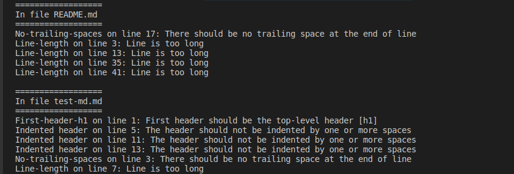

# Md-lint

Md-lint is a linter for files written in a markdown format. The rules enforced by this linter are based on the standards of many other linters. Unlike other linters however, it does not support a config file to customize the rules.

## Built With

- Ruby
- Rubocop
- Rspec

## Getting Started

To use this linter, please check the requirements and follow the steps listed below.

### Prerequisites

- Ruby >= 2.7.0 

### Install

- `git clone` [repo](https://github.com/Blaise-Shyaka/md-lint)
- `cd md-lint`

### How to use the linter

- To lint all the files markdown in the directory, run `./bin/main.rb`
- To lint a file individually, run `./bin/main.rb <filename>`

## How to run the tests

### Prerequisites

- rspec >= 3.9.x

### Running tests

- In the command line, run `pwd` and make sure the current directory is `md-lint`
- Run `rspec` command and all tests results will be output in command line

## Author

👤 **Blaise Pascal SHYAKA**

- GitHub: [@Blaise-Shyaka](https://github.com/Blaise-Shyaka/)
- Twitter: [@blaise_shyaka95](https://twitter.com/blaise_shyaka95)
- LinkedIn: [Blaise Pascal SHYAKA](https://linkedin.com/in/blaise-pascal-shyaka-b1340b111)

## 🤝 Contributing

Contributions, issues, and feature requests are welcome!

Feel free to check the [issues page](https://github.com/Blaise-Shyaka/md-lint/issues).

## Show your support

Give a ⭐️ if you like this project!

## Acknowledgments

- The Cupids team for review and suggestions

## 📝 License

This project is [MIT](./LICENSE) licensed.